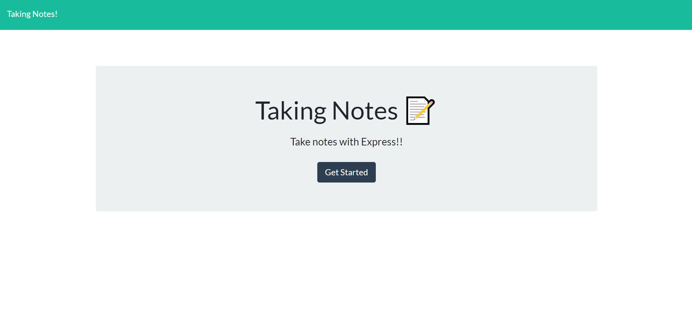

# TakingNotes

MIT license
    
## Description
An app called taking notes that allows you to quickly save pieces of text to open and see later. 
[project link](https://github.com/lretana1/TakingNotes)

## Table Of Contents
* [Installation](#user-content-installation)
* [Usage](#user-content-usage)
* [Licenses](#user-content-licenses)
* [Tests](#user-content-tests)
* [Questions](#user-content-questions)
    
## Installation
1. application is deployed at heroku  - https://luis-note-taker.herokuapp.com/
## Usage
Write and save notes for personal use.

## Screenshot

## License

MIT license
    
## Contributing
Currently not looking for additional help.
 
## Tests
run node server.js to begin if going through github.

## Questions
for any questions please send me and email to <> or check out my GitHub profile: [lretana1](https://github.com/lretana1)  

